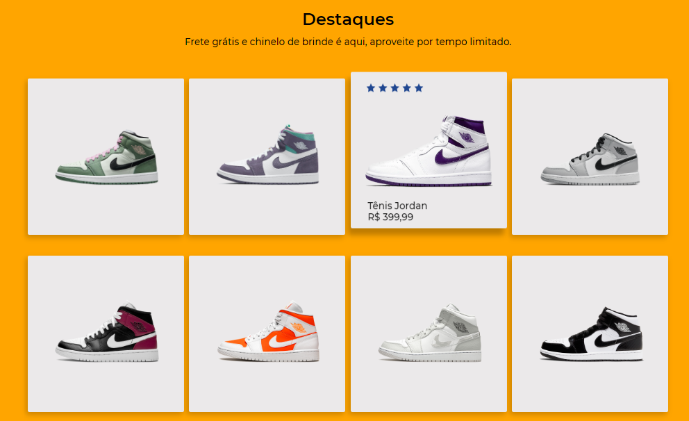
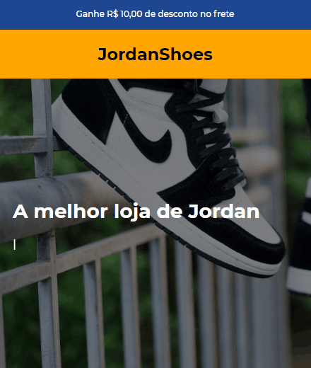

<h1 align="center">Challenge 02 - JordanShoes Store 👟</h1>

The project is a challenge proposed by discord community <a href="https://discord.gg/wNCWTVuxyz" target="_blank">@Codelândia</a>

  

## 🗺️ navigation 

  - [About](#about)
  - [Gifs](#gifs)
    - [Desktop](#desktop)
    - [Mobile](#mobile)
  - [Figma](#figma)
  - [Technologies](#tech)
  - [Demo](#demo)
  - [Author](#author)

<h2 id="about">📃 About</h2>

This challenge consisted of creating a shoes store. The base layout was provided by comunnity on [Figma](https://www.figma.com/). Feel free to look more about it!

<h2 id="gifs">👾 Gifs</h2>

Below, you can see the captured GIFs about this project on both models (desktop and mobile).

<h3 id="desktop">📱 Desktop layout</h3>

<h4 align="center">
  
</h4>

<h3 id="mobile">🖥️ Mobile layout</h3>

<h4 align="center">
  
</h4>

<h2 id="figma">🖼️ Figma</h2>

You can access the project's layout [clicking here!](https://www.figma.com/file/Yb9IBH56g7T1hdIyZ3BMNO/Desafios---Codel%C3%A2ndia?node-id=39819%3A689)

<h2 id="tech">🚀 Technologies</h2>

Bellow is all technologies used in this project:

 

<h2 id="demo">🕶️ Demo</h2>

You can see the demo [clicking here!](https://felipegueller.github.io/desafios-codelandia/challenge_02/)

<h2 id="author">👨‍🔬 Author</h2>

<table>
  <tr>
    <td align="center">
      <a href="https://github.com/felipegueller">
          
        
          <b>Felipe Gueller</b>
        
      </a>
    </td>
  </tr>
</table>

> Made with ❤️ by FELIPE GUELLER 👋 [See my Linkedin](https://www.linkedin.com/in/felipegueller/)
